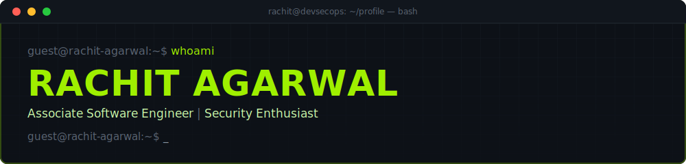

<div align="center">



### `whoami` → **Rachit Agarwal**
### `role` → Associate Software Engineer | Cybersecurity Enthusiast | DevSecOps Learner


[](https://rachitagarwal.vercel.app)
[](https://linkedin.com/in/rachit-agarwal-963773188)
[](mailto:agarwalrachit1943@gmail.com)
[](https://github.com/Wolf1904)

</div>

<br>

```bash
guest@rachit-agarwal:~$ neofetch
```

```yaml
OS:            Kali Linux (daily driver)
Role:          Associate Software Engineer
Focus:         DevSecOps, Cloud Security, Secure Software Development
Languages:     Java, Python, C++, C, JavaScript, Bash
Currently:     Learning Kubernetes, Docker, Cloud Security
Practice:      CTFs, HackTheBox
Research:      Blockchain-based E-Waste Management (ICITEEB 2025)
```

<br>

```bash
guest@rachit-agarwal:~$ ls -la tech_stack/
```

<div align="center">

**// LANGUAGES**


**// DEVOPS**


**// DATABASE**


</div>

<br>

```bash
guest@rachit-agarwal:~$ ./run_toolkit.sh --list
```

| Category | Tools |
|---|---|
| 🌐 Web Exploitation | `Burp Suite` `OWASP ZAP` |
| 📡 Network Recon | `Nmap` `Wireshark` |
| 🛡️ Code / Static Analysis | `SonarQube` |
| 🔌 Network Simulation | `Cisco Packet Tracer` |

<br>

```bash
guest@rachit-agarwal:~$ find . -name "*.project" -type f
```

<div align="center">

| Project | Description |
|---|---|
| 🎯 **CyberMatrix** | Cybersecurity educational platform built with Streamlit |
| 🎯 **Troubleshooting Knowledge Base** | A structured collection of real-world system issues, their root causes, and practical solutions |
| 🎯 **DefenderBytes** | Java-based antivirus scanner |
| 🎯 **TurboTrove** | Car dealership management system with CI/CD |

</div>

> Swap in your repo links so each project title points to its source.

<br>

```bash
guest@rachit-agarwal:~$ cat research.log
```

**AAVARTAK: Paving the Path for Sustainable E-Waste Management**
Accepted at **ICITEEB 2025** · Published as a **Chapter** with **Taylor & Francis**

<br>

```bash
guest@rachit-agarwal:~$ curl -s https://api.github.com/users/Wolf1904/stats
```

<div align="center">


</div>

<div align="center">

</div>

<div align="center">

</div>

<div align="center">

</div>

<br>

```bash
guest@rachit-agarwal:~$ tail -f /var/log/current_focus.log
```

- [x] Secure Software Development
- [x] DevSecOps
- [x] Linux Administration
- [x] Penetration Testing
- [ ] Cloud Security
- [ ] Reverse Engineering

<br>

```bash
guest@rachit-agarwal:~$ echo "connection established — thanks for stopping by"
```

<div align="center">


</div>
